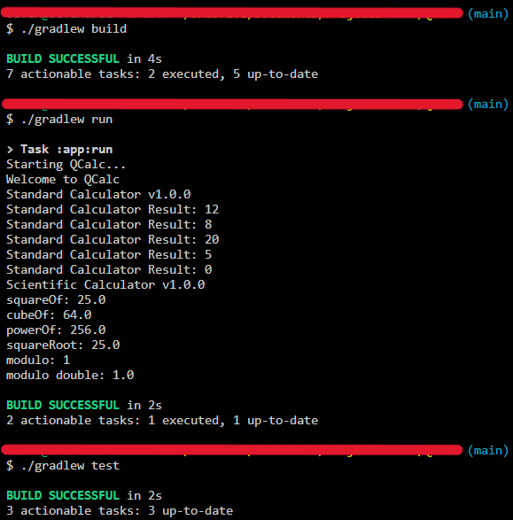

# QCalc
`Java` `Debugging` `Unit Testing`

---

Build a simple calculator project using Java from scratch

---

This project aims to obtain basic skills in Java by building a subset of features seen in calculators.

---

During the course of this Micro-Experience, the developer:

* Generated a new Java project using Gradle.
* Built features of a calculator by using Java.
* Fixed the bugs in the implementation of newly introduced features of the calculator.

---

# Overview
This project aims to obtain basic skills in Java by building a subset of features seen in calculators.

During the course of this Micro-Experience, the developer:

* Generated a new Java project using Gradle.
* Built features of a calculator by using Java.
* Fixed the bugs in the implementation of newly introduced features of the calculator.

---

# Implement simple calculator
## Scope of work
1. Generate a Java Gradle Project using the command line tool.
2. Implement basic arithmetic operations and run unit tests to verify the functionalities.

## Skills used
`Java` `Unit Testing`

---

# Debug and fix issues
## Scope of work
1. Fix compilation errors caused due to syntax/import issues.
2. Resolve logical issues in the code.
3. Fix the definition of a method based on a given datatype.
4. Execute Unit Tests to verify the correctness of the functionalities

## Skill used
`Java` `Debugging` `Unit Testing`

---

# Screenshots

